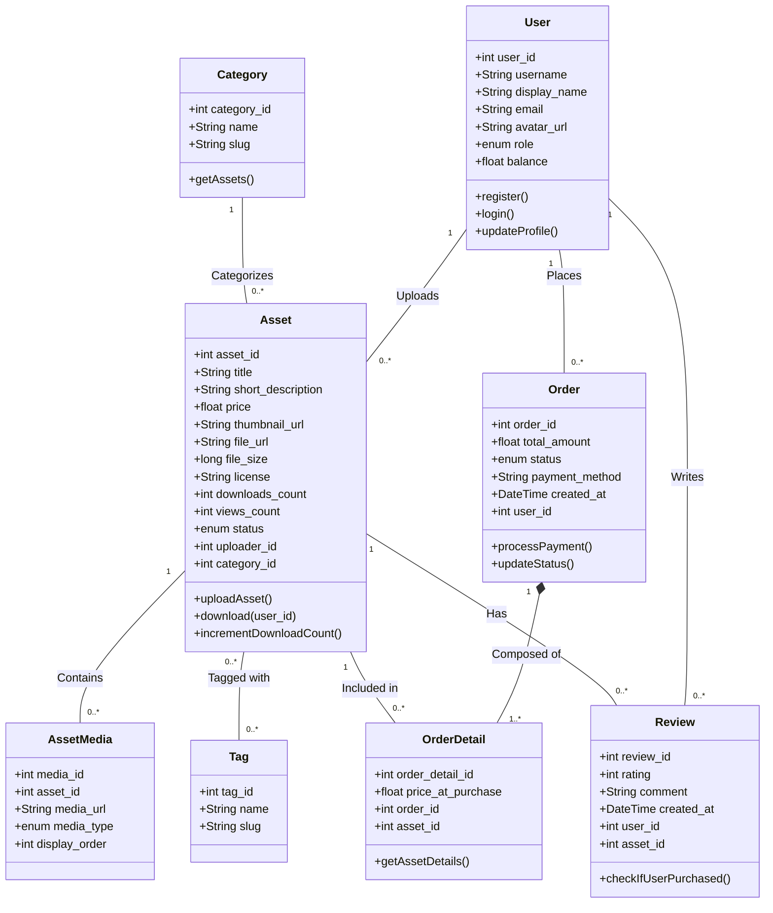

# Báo Cáo Dự Án: Thiết Kế Web Nâng Cao

## 1. Thông tin Nhóm sinh viên
- **Link Github Repo:** `https://github.com/itcoder2k/ITWebNC-NO2`
- **Giảng viên hướng dẫn:** Nguyễn Lệ Thu

**Danh sách thành viên & Phân công nhiệm vụ:**
1. **Nguyễn Trọng Hùng** - `23010083` 
2. **Nguyễn Hữu Hưng** - `23010124` 
3. **Nguyễn Mạnh Thắng** - `23010098` 
4. **Vũ Quốc Toản** - `23010003` 

---

## 2. Xây dựng nội dung dự án cuối kỳ

**Tên dự án:** Xây dựng hệ thống quản lý và giao dịch tài nguyên trò chơi trực tuyến (Game Asset Marketplace).

**Mô tả chi tiết:** 
Dự án là một nền tảng thương mại điện tử đặc thù (Marketplace) dành riêng cho cộng đồng phát triển game và thiết kế đồ họa. Hệ thống giải quyết bài toán lưu trữ, hiển thị và giao dịch các tệp tài nguyên số (Digital Assets).
- **Góc độ người mua (Khách hàng/Developer):** Có thể tìm kiếm, xem trước (preview), thêm vào giỏ hàng, thanh toán và tải xuống các tài nguyên như mô hình 3D (.obj, .fbx), file animation (.skel, .atlas), hiệu ứng âm thanh, và mã nguồn (scripts).
- **Góc độ người bán (Creator/Modder):** Có công cụ để tải file lên, quản lý kho tài nguyên cá nhân, định giá bán và theo dõi doanh thu.
- **Góc độ quản trị (Admin):** Kiểm duyệt nội dung tải lên, quản lý người dùng, xử lý khiếu nại và quản lý danh mục hệ thống.

---

## 3. Phân tích bài toán chi tiết

### 3.1. Các quy trình nghiệp vụ cốt lõi (Business Workflows)
Hệ thống vận hành dựa trên 2 luồng nghiệp vụ chính:
- **Luồng mua hàng (Dành cho Khách hàng):** Tìm kiếm/Lọc tài nguyên theo danh mục -> Xem chi tiết tài nguyên (ảnh preview, mô tả) -> Thêm vào giỏ hàng (Cart) -> Tiến hành thanh toán tạo Đơn hàng (Order) -> Mở khóa quyền tải xuống (Download) các tệp tài nguyên.
- **Luồng bán hàng (Dành cho Creator/Modder):** Đăng nhập -> Tải lên tệp tài nguyên (Upload) -> Nhập metadata (tên, mô tả, giá bán, ảnh thumbnail) -> Xuất bản (Publish) -> Theo dõi lượt mua và đánh giá từ người dùng.

### 3.2. Phân tích các đối tượng (Entities) và Thuộc tính
Hệ thống được thiết kế theo mô hình sàn giao dịch game assets phong cách **itch.io** với các thực thể cốt lõi:

1. **User (Người dùng):** Quản lý thông tin xác thực, định danh và hồ sơ Creator.
   - `user_id` (PK): Định danh duy nhất.
   - `username`, `email`, `password_hash`: Thông tin đăng nhập.
   - `display_name`, `avatar_url`, `bio`: Thông tin hiển thị và hồ sơ Creator.
   - `role`: Phân quyền (`Admin`, `Creator`, `Customer`).
   - `balance`: Số dư ví nội bộ.

2. **Category (Danh mục):** Phân loại tài nguyên theo nhóm lớn (2D, 3D, Audio, UI).
   - `category_id` (PK): Định danh danh mục.
   - `name`: Tên danh mục.
   - `slug`: Đường dẫn URL thân thiện (VD: `2d-assets`, `3d-models`).
   - `description`: Mô tả danh mục.

3. **Tag (Thẻ gắn):** Hệ thống gắn thẻ linh hoạt theo phong cách itch.io (Pixel Art, Low Poly, Sci-Fi,...).
   - `tag_id` (PK): Định danh thẻ.
   - `name`: Tên thẻ hiển thị.
   - `slug`: Đường dẫn URL thân thiện.

4. **Asset (Tài nguyên Game):** Trọng tâm của hệ thống, lưu trữ thông tin sản phẩm.
   - `asset_id` (PK), `uploader_id` (FK), `category_id` (FK).
   - `title`: Tiêu đề tài nguyên.
   - `short_description`: Tagline ngắn gọn hiển thị trên các thẻ sản phẩm (Card grid).
   - `description`: Mô tả chi tiết đầy đủ (hỗ trợ Markdown/HTML).
   - `price`: Giá bán (0.00 là miễn phí).
   - `thumbnail_url`: Ảnh bìa đại diện (Cover image).
   - `file_url`: Đường dẫn tới tệp tải gốc (.zip, .rar).
   - `file_size`: Kích thước tệp (bytes).
   - `license`: Giấy phép sử dụng (VD: CC0, CC-BY, Commercial).
   - `views_count`, `downloads_count`: Thống kê tương tác.
   - `status`: Trạng thái (`active`, `archived`, `pending`).

5. **AssetMedia (Thư viện Demo & Screenshot):** Lưu trữ nhiều ảnh/GIF/video preview cho 1 asset.
   - `media_id` (PK), `asset_id` (FK).
   - `media_url`: Đường dẫn ảnh chụp màn hình, ảnh GIF hoạt ảnh hoặc video.
   - `media_type`: Loại phương tiện (`image`, `gif`, `video`).
   - `display_order`: Thứ tự hiển thị trong bộ sưu tập (Gallery/Carousel).

6. **AssetTag (Bảng liên kết Nhiều - Nhiều):** Gắn nhiều thẻ vào một tài nguyên.
   - `asset_id` (PK, FK), `tag_id` (PK, FK).

7. **Review (Đánh giá & Phản hồi):** Cho phép người mua để lại nhận xét và số sao.
   - `review_id` (PK), `user_id` (FK), `asset_id` (FK).
   - `rating`: Điểm đánh giá (1 - 5 sao).
   - `comment`: Nội dung nhận xét.
   - `created_at`: Thời gian đánh giá.

8. **Order (Đơn hàng):** Ghi nhận các phiên giao dịch mua bán.
   - `order_id` (PK), `user_id` (FK - Người mua).
   - `total_amount`: Tổng giá trị thanh toán.
   - `payment_method`: Phương thức thanh toán (`wallet`, `vnpay`, `momo`).
   - `status`: Trạng thái (`Pending`, `Completed`, `Cancelled`).

9. **OrderDetail (Chi tiết đơn hàng):** Bóc tách các mặt hàng trong một đơn hàng.
   - `order_detail_id` (PK), `order_id` (FK), `asset_id` (FK).
   - `price_at_purchase`: Giá tại thời điểm mua (Snapshot giá tránh sai lệch doanh thu khi Creator đổi giá).

### 3.3. Các ràng buộc nghiệp vụ (Business Rules)
- **Ràng buộc tải xuống:** Một tài khoản Customer chỉ được phép gọi hàm `download()` đối với các `Asset` có giá = 0 (Free) HOẶC tồn tại trong `OrderDetail` thuộc về một `Order` có trạng thái là `Completed` của người đó (đã thanh toán thành công).
- **Ràng buộc đánh giá:** Chỉ người dùng đã sở hữu tài nguyên mới được phép tạo `Review` cho tài nguyên đó (Verified Purchase). Mỗi người dùng chỉ đánh giá 1 lần cho mỗi Asset.
- **Ràng buộc xóa tài khoản:** Nếu xóa một tài khoản `Creator`, các `Asset` của họ không bị xóa hoàn toàn khỏi DB mà sẽ chuyển trạng thái sang `Archived` (hoặc set `uploader_id = NULL`) để đảm bảo những khách hàng cũ vẫn có thể tải lại file họ đã mua.

### 3.4. Sơ đồ chức năng tổng thể (UML Class Diagram)

