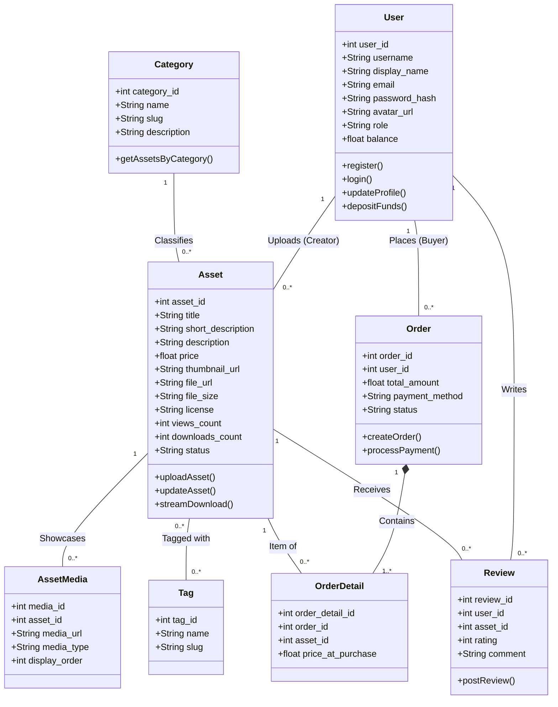

# BÁO CÁO DỰ ÁN MÔN HỌC: THIẾT KẾ WEB NÂNG CAO
# ĐỀ TÀI: SÀN GIAO DỊCH TÀI NGUYÊN TRÒ CHƠI TRỰC TUYẾN (GAME ASSET MARKETPLACE)
> **Nền tảng mô phỏng tham chiếu:** Chuyên mục Game Assets của **itch.io** (`itch.io/game-assets`).  
> **Kiến trúc phát triển phần mềm:** **Kiến trúc phân lớp (Layered Architecture / N-Tier Architecture)** theo chuẩn bài giảng học phần *Thiết Kế Web Nâng Cao* (Lec3 - GV. Nguyễn Lệ Thu).

---

## 1. THÔNG TIN NHÓM SINH VIÊN & PHÂN CÔNG NHIỆM VỤ

* **Trường Đại học:** Đại học Phenikaa (Phenikaa University)
* **Khoa:** Công nghệ Thông tin
* **Học phần:** Thiết kế Web Nâng Cao
* **Giảng viên hướng dẫn:** ThS. Nguyễn Lệ Thu
* **Kho lưu trữ GitHub (Repo):** [https://github.com/itcoder2k/ITWebNC-NO2](https://github.com/itcoder2k/ITWebNC-NO2)

### 1.1. Bảng phân công nhiệm vụ theo đối tượng & các lớp (Từng thành viên phụ trách)
Theo yêu cầu đồ án, mỗi sinh viên trong nhóm chịu trách nhiệm độc lập xây dựng trọn vẹn một hoặc nhiều đối tượng theo mô hình **Kiến trúc phân lớp** (bao gồm đủ các lớp: `Controller`, `Service`, `Provider`, `Entity`, `DTO`):

| STT | Họ và tên | Mã sinh viên | Vai trò | Đối tượng phụ trách chính | Các lớp triển khai theo Kiến trúc Phân lớp |
| :---: | :--- | :---: | :---: | :--- | :--- |
| 1 | **Nguyễn Trọng Hùng** | `23010083` | **Nhóm trưởng** | **`User`** (Người dùng & Ví tiền)<br>& **`Auth`** (Xác thực bảo mật) | • **Presentation:** `user.controller.ts`, `auth.controller.ts`<br>• **Business Logic:** `user.service.ts`, `auth.service.ts`<br>• **Data Access:** `user.provider.ts` (Inject `DATA_SOURCE`)<br>• **Entity/Model:** `user.entity.ts`<br>• **DTO:** `create-user.dto.ts`, `update-user.dto.ts`, `login.dto.ts` |
| 2 | **Nguyễn Hữu Hưng** | `23010124` | **Thành viên** | **`Tag`** (Thẻ gắn đa tiêu chí)<br>& **`AssetMedia`** (Demo Gallery) | • **Presentation:** `tag.controller.ts`<br>• **Business Logic:** `tag.service.ts`<br>• **Data Access:** `tag.provider.ts`, `asset-media.provider.ts`<br>• **Entity/Model:** `tag.entity.ts`, `asset-media.entity.ts`, `asset-tags.entity.ts`<br>• **DTO:** `create-tag.dto.ts`, `add-media.dto.ts` |
| 3 | **Nguyễn Mạnh Thắng** | `23010098` | **Thành viên** | **`Category`** (Danh mục phân loại)<br>& **`Database`** (Cấu hình CSDL chung) | • **Presentation:** `category.controller.ts`<br>• **Business Logic:** `category.service.ts`<br>• **Data Access:** `category.provider.ts`, `database.providers.ts`<br>• **Entity/Model:** `category.entity.ts`<br>• **DTO:** `create-category.dto.ts`, `update-category.dto.ts`<br>• **Database Module:** Quản lý kết nối TypeORM MySQL |
| 4 | **Vũ Quốc Toản** | `23010003` | **Thành viên** | **`Asset`** (Tài nguyên Game),<br>**`Order`** (Đơn hàng) & **`Review`** | • **Presentation:** `asset.controller.ts`, `order.controller.ts`, `review.controller.ts`<br>• **Business Logic:** `asset.service.ts`, `order.service.ts`, `review.service.ts`<br>• **Data Access:** `asset.provider.ts`, `order.provider.ts`, `review.provider.ts`<br>• **Entity/Model:** `asset.entity.ts`, `order.entity.ts`, `order-detail.entity.ts`, `review.entity.ts`<br>• **DTO:** `create-asset.dto.ts`, `checkout.dto.ts`, `create-review.dto.ts` |

---

## 2. PHÂN TÍCH ĐẶC TẢ HỆ SINH THÁI MÔ PHỎNG ITCH.IO

itch.io là nền tảng phân phối game độc lập và tài nguyên số (Indie Game Assets) lớn và tự do nhất hiện nay. Để mô phỏng chân thực và đầy đủ hệ sinh thái **itch.io/game-assets**, dự án phân tích và tích hợp các đặc trưng độc bản sau:

### 2.1. Các đặc trưng cốt lõi mô phỏng itch.io (Core itch.io Features)

1. **Hệ thống Định giá linh hoạt "Pay What You Want" (PWYW / Ủng hộ tác giả):**
   - Trên itch.io, Creator thiết lập một mức **giá sàn tối thiểu (Minimum Price)**: có thể là miễn phí ($0.00) hoặc có phí (ví dụ $5.00).
   - Khi thanh toán, người mua có quyền nhập số tiền lớn hơn giá sàn (ví dụ trả $10.00 thay vì $5.00) để donate, khích lệ tinh thần nghệ sĩ indie.
2. **Trải nghiệm Demo đa phương tiện (Rich Media Preview Gallery):**
   - Khác với e-commerce thông thường chỉ có ảnh tĩnh, sàn game asset đòi hỏi:
     - **Sprite Sheet & Ảnh động GIF:** Cho phép xem trước chuyển động hoạt họa của nhân vật (Walk, Run, Attack, Jump) ngay trên nền tảng.
     - **Audio Player tích hợp:** Nghe thử các tệp hiệu ứng âm thanh (SFX) hoặc nhạc nền (BGM) trực tiếp mà không cần tải file về máy.
3. **Cơ chế Thẻ gắn đa chiều (itch.io Multi-Dimensional Tag Engine):**
   - itch.io không giới hạn sản phẩm trong 1 danh mục cứng nhắc mà kết hợp ma trận tags lọc chéo:
     - *Phong cách nghệ thuật (Art Style):* `#pixel-art`, `#low-poly`, `#voxel`, `#vector`, `#retro-16bit`.
     - *Góc nhìn game (Perspective):* `#top-down`, `#side-scroller`, `#isometric`, `#first-person`.
     - *Định dạng & Trạng thái:* `#animated`, `#tileset`, `#seamless-texture`, `#looping-audio`.
4. **Hệ thống Giấy phép Bản quyền Game (Game Asset Licensing):**
   - Mọi tài nguyên đăng tải đều minh bạch về điều khoản cấp phép:
     - `CC0 (Public Domain):` Miễn phí hoàn toàn, sử dụng cho mọi mục đích thương mại không cần ghi công.
     - `CC-BY (Attribution):` Được dùng thương mại nhưng bắt buộc ghi tên tác giả trong phần Credits của game.
     - `Standard Indie Commercial License:` Được sử dụng trong game thương mại, không được bán lại (resale) nguyên mẫu tệp tài nguyên gốc.
5. **Thư viện tài nguyên cá nhân (My Library & Claim System):**
   - Khi mua hoặc nhận tài nguyên miễn phí, sản phẩm được lưu vĩnh viễn vào **My Library** của tài khoản.
   - Người dùng có thể quay lại tải bất kỳ lúc nào mà không phải thanh toán lại.
6. **Bảo mật Tệp tải xuống (Protected Download Stream):**
   - Tệp nén gốc (`.zip`, `.rar`) được lưu trữ tại phân vùng bảo vệ trên server. Hệ thống tuyệt đối không public đường dẫn URL trực tiếp mà kiểm tra quyền sở hữu qua JWT trước khi stream dữ liệu tệp tin về máy người dùng.
7. **Đánh giá có xác thực (Verified Purchase Reviews):**
   - Chỉ những tài khoản đã mua hoặc đã sở hữu tài nguyên trong thư viện mới được phép chấm điểm sao (1 - 5 sao) và gửi đánh giá nhận xét.

---

### 2.2. Biểu đồ Ca Sử Dụng Tổng Thể (Use Case Diagram)

Hệ thống phân định 4 nhóm tác nhân (Actors) chính với các ca sử dụng tương ứng:


```mermaid
graph TD
    classDef actorStyle fill:#2d3748,stroke:#4a5568,stroke-width:2px,color:#fff;
    classDef usecaseStyle fill:#1a202c,stroke:#e53e3e,stroke-width:1.5px,color:#edf2f7;

    Guest["Khách vãng lai (Guest)"]:::actorStyle
    Customer["Người mua (Buyer/Customer)"]:::actorStyle
    Creator["Nhà sáng tạo (Creator)"]:::actorStyle
    Admin["Quản trị viên (Admin)"]:::actorStyle

    subgraph "HỆ THỐNG GAME ASSET MARKETPLACE (ITCH.IO SIMULATION)"
        UC1(["Xem & Tìm kiếm tài nguyên"]):::usecaseStyle
        UC2(["Lọc đa chiều theo Tags & Category"]):::usecaseStyle
        UC3(["Xem trước Demo Gallery (Ảnh/GIF/Audio)"]):::usecaseStyle
        UC4(["Đăng ký / Đăng nhập (JWT)"]):::usecaseStyle
        
        UC5(["Nạp tiền vào ví điện tử"]):::usecaseStyle
        UC6(["Mua tài nguyên (Ủng hộ PWYW)"]):::usecaseStyle
        UC7(["Quản lý Thư viện cá nhân (My Library)"]):::usecaseStyle
        UC8(["Tải tệp tin gốc an toàn (Stream File)"]):::usecaseStyle
        UC9(["Đánh giá & Chấm sao (Verified Review)"]):::usecaseStyle

        UC10(["Đăng bán tài nguyên mới (Upload File/Media)"]):::usecaseStyle
        UC11(["Quản lý giá bán & Giấy phép bản quyền"]):::usecaseStyle
        UC12(["Bảng điều khiển tác giả (Dashboard Doanh thu)"]):::usecaseStyle

        UC13(["Quản lý Danh mục & Thẻ Tags"]):::usecaseStyle
        UC14(["Kiểm duyệt nội dung & Quản lý người dùng"]):::usecaseStyle
    end

    Guest --> UC1
    Guest --> UC2
    Guest --> UC3
    Guest --> UC4

    Customer --> UC1
    Customer --> UC2
    Customer --> UC3
    Customer --> UC5
    Customer --> UC6
    Customer --> UC7
    Customer --> UC8
    Customer --> UC9

    Creator --> UC10
    Creator --> UC11
    Creator --> UC12

    Admin --> UC13
    Admin --> UC14
```

---

## 3. PHÂN TÍCH CHUYÊN SÂU KIẾN TRÚC PHÂN LỚP (LAYERED ARCHITECTURE)

Dự án được xây dựng theo chuẩn **Kiến trúc Phân lớp (Layered Architecture / N-Tier Architecture)** của học phần *Thiết Kế Web Nâng Cao* (Lec3 - GV. Nguyễn Lệ Thu, Slide 18).

### 3.1. Các Nguyên Tắc Kiến Trúc Bắt Buộc (Architectural Governance)

1. **Nguyên tắc Tách biệt mối quan tâm (Separation of Concerns - SoC):** Mỗi tầng đảm nhiệm một ranh giới chức năng duy nhất.
2. **Quy tắc Phụ thuộc một chiều (Layer Dependency Rule):** 
   - Tầng trên được phép gọi và phụ thuộc vào tầng dưới trực tiếp liền kề.
   - Tầng dưới **tuyệt đối không được phép** gọi ngược hay phụ thuộc vào tầng trên.
   - *Chuỗi phụ thuộc:* `Presentation Layer (Controllers)` ➔ `Business Logic Layer (Services)` ➔ `Data Access Layer (Providers / Repositories)` ➔ `Database & Entity Layer (TypeORM / MySQL)`.
3. **Nguyên lý Đảo ngược phụ thuộc (Inversion of Control - IoC & Dependency Injection - DI):**
   - Tầng Service không tự khởi tạo kết nối hay repository bằng từ khóa `new`, mà nhận đối tượng repository thông qua bộ nạp DI của NestJS: `@Inject('USER_REPOSITORY') private repo: Repository<User>`.
   - Giúp mã nguồn đạt chuẩn ghép nối lỏng (Loose Coupling), cực kỳ thuận lợi cho việc kiểm thử tự động (Unit Test / Mocking).

---

### 3.2. Mô hình 4 Tầng Cốt Lõi (The 4 Layers Architecture)

```
┌────────────────────────────────────────────────────────────────────────────────────────┐
│                      TẦNG 1: PRESENTATION LAYER (TẦNG TRÌNH DIỄN)                      │
│                                                                                        │
│  [Phía Client - React 19]          │  [Phía Server - NestJS Controllers]               │
│  • Pages (Trang giao diện)         │  • *.controller.ts                                │
│  • UI Components (Nút bấm, Form)   │  • Nhiệm vụ: Tiếp nhận HTTP Request (GET/POST/..),│
│  • Client API Axios Client         │    Validate dữ liệu đầu vào qua DTO/Pipes,        │
│  • React Context (Auth, Cart)      │    điều hướng đến Service và trả HTTP Response.   │
└───────────────────────────────────────────┬────────────────────────────────────────────┘
                                            │ DTOs (Data Transfer Objects đã được kiểm tra)
                                            ▼
┌────────────────────────────────────────────────────────────────────────────────────────┐
│                   TẦNG 2: BUSINESS LOGIC LAYER (TẦNG NGHIỆP VỤ / DỊCH VỤ)              │
│                                                                                        │
│  [Services - *.service.ts]                                                             │
│  • UserService, AuthService, AssetService, CategoryService, OrderService, ReviewService│
│  • Nhiệm vụ: Trái tim của hệ thống. Chứa toàn bộ các quy tắc nghiệp vụ (Business Rules)│
│    - Băm mật khẩu Bcrypt & sinh JWT Token đăng nhập                                    │
│    - Kiểm tra số dư ví & thực hiện giao dịch mua tài nguyên (Transaction)               │
│    - Kiểm tra quyền sở hữu tệp trước khi cho phép tải file (Protected Download)        │
│    - Kiểm tra điều kiện người mua mới được để lại bình luận/đánh giá (Verified Review) │
│    - Tăng số lượt xem (views_count) và lượt tải (downloads_count)                     │
└───────────────────────────────────────────┬────────────────────────────────────────────┘
                                            │ Gọi hàm qua Repository Interface / Data Source
                                            ▼
┌────────────────────────────────────────────────────────────────────────────────────────┐
│                TẦNG 3: DATA ACCESS LAYER / PERSISTENCE (TẦNG TRUY XUẤT DỮ LIỆU)        │
│                                                                                        │
│  [Providers & Repositories - *.provider.ts]                                            │
│  • user.provider.ts, asset.provider.ts, category.provider.ts, order.provider.ts, ...   │
│  • Nhiệm vụ: Đóng gói toàn bộ logic truy vấn CSDL. Sử dụng TypeORM `DATA_SOURCE`       │
│    để lấy Repository tương ứng của từng đối tượng:                                     │
│    `provide: 'USER_REPOSITORY', useFactory: (ds) => ds.getRepository(User)`           │
│  • Tách biệt hoàn toàn tầng Service khỏi chi tiết kỹ thuật của CSDL hoặc câu lệnh SQL.  │
└───────────────────────────────────────────┬────────────────────────────────────────────┘
                                            │ Object-Relational Mapping (ORM)
                                            ▼
┌────────────────────────────────────────────────────────────────────────────────────────┐
│               TẦNG 4: DATABASE & ENTITY LAYER (TẦNG THỰC THỂ & CƠ SỞ DỮ LIỆU)          │
│                                                                                        │
│  [Entities & Database Schema - *.entity.ts & MySQL Server]                             │
│  • Entities: User, Asset, AssetMedia, Category, Tag, Order, OrderDetail, Review        │
│  • Database Engine: Hệ quản trị CSDL quan hệ MySQL 8.0 (`GameAssetDB`)                 │
│  • Nhiệm vụ: Định nghĩa cấu trúc bảng (Table Schemas), khóa chính (PK), khóa ngoại     │
│    (FK), chỉ mục (Indexes) và đảm bảo tính toàn vẹn dữ liệu (ACID Transactions).        │
└────────────────────────────────────────────────────────────────────────────────────────┘
```

---

### 3.3. Vai trò & Đặc điểm chi tiết của từng Lớp

1. **`*.controller.ts` (Tầng Trình diễn - Presentation Layer):**
   - Đón nhận HTTP Requests từ Client, kiểm tra xác thực người dùng (`@UseGuards(JwtAuthGuard)`).
   - Gọi `ValidationPipe` để tự động kiểm tra dữ liệu theo DTO.
   - Gọi tầng Service và trả kết quả dưới dạng HTTP Response kèm mã trạng thái (`200 OK`, `201 Created`, `400 Bad Request`, `401 Unauthorized`,...).
   - **Quy tắc:** Không chứa bất kỳ câu truy vấn cơ sở dữ liệu hay mã tính toán nghiệp vụ nào.
2. **`*.service.ts` (Tầng Nghiệp vụ - Business Logic Layer):**
   - Xử lý các quy tắc nghiệp vụ: kiểm tra số dư ví, trừ tiền, chia phần trăm doanh thu cho Creator, tạo mã token tải file.
   - Quản lý các giao dịch dữ liệu đa bước bằng cơ chế Transaction để đảm bảo tính nguyên vẹn (ACID).
3. **`*.provider.ts` (Tầng Truy xuất Dữ liệu - Data Access Layer):**
   - Kết nối với `DATA_SOURCE` được export từ `DatabaseModule`.
   - Cung cấp (Provide) đối tượng TypeORM Repository cho từng Entity:
     ```typescript
     export const userProviders = [
       {
         provide: 'USER_REPOSITORY',
         useFactory: (dataSource: DataSource) => dataSource.getRepository(User),
         inject: ['DATA_SOURCE'],
       },
     ];
     ```
4. **`*.entity.ts` (Tầng Thực thể - Entity Layer):**
   - Định nghĩa các lớp ánh xạ tương ứng 1-1 với các bảng trong MySQL thông qua các TypeORM Decorators.
5. **`*.dto.ts` (Data Transfer Objects):**
   - Định nghĩa dữ liệu truyền giữa Controller và Service, sử dụng decorator kiểm tra hợp lệ của thư viện `class-validator` (`@IsString()`, `@IsNumber()`, `@IsEmail()`, `@Min()`).
6. **`database/` (Tầng Kết nối CSDL Nền tảng):**
   - Khởi tạo kết nối vật lý tới MySQL Server (`database.providers.ts`), nạp các thông số môi trường (`.env`) và export `DATA_SOURCE` qua `database.module.ts`.

---

### 3.4. Sơ đồ Luồng Tuần tự Xử lý qua 4 Tầng (Sequence Diagram)

Dưới đây là sơ đồ luồng dữ liệu minh họa nghiệp vụ **Mua tài nguyên theo mô hình Pay What You Want (PWYW) của itch.io** đi qua đầy đủ 4 tầng:

```mermaid
sequenceDiagram
    autonumber
    actor Client as Người mua (Client App)
    participant C as OrderController (Presentation)
    participant S as OrderService (Business Logic)
    participant P as OrderProvider / Repo (Data Access)
    participant DB as MySQL Database (Persistence)

    Client->>C: POST /api/order/checkout { asset_id: 10, pay_amount: 12.00 } + JWT
    Note over C: Tầng 1: Presentation Layer
    C->>C: Xác thực JWT & Kiểm tra CheckoutDto
    C->>S: checkout(buyerId, checkoutDto)
    
    Note over S: Tầng 2: Business Logic Layer
    S->>P: Truy vấn thông tin người mua (User) & Số dư ví
    P->>DB: SELECT * FROM Users WHERE user_id = buyerId
    DB-->>P: User record (balance = $20.00)
    P-->>S: User Entity
    
    S->>P: Truy vấn thông tin tài nguyên (Asset)
    P->>DB: SELECT * FROM Assets WHERE asset_id = 10
    DB-->>P: Asset record (min_price = $5.00, uploader_id = 2)
    P-->>S: Asset Entity
    
    Note over S: Kiểm tra nghiệp vụ itch.io (PWYW):
    Note over S: 1. Số tiền trả ($12) >= Giá sàn tối thiểu ($5) -> HỢP LỆ!
    Note over S: 2. Số dư ví ($20) >= Số tiền trả ($12) -> HỢP LỆ!
    Note over S: Mở Database Transaction (ACID)
    
    S->>P: Trừ $12 ví người mua & Cộng tiền ví tác giả (Creator)
    P->>DB: UPDATE Users SET balance = balance - 12 WHERE user_id = buyerId;
    P->>DB: UPDATE Users SET balance = balance + 12 WHERE user_id = uploaderId;
    
    S->>P: Lưu hóa đơn Order (total = $12) & OrderDetail (asset_id = 10, price = $12)
    P->>DB: INSERT INTO Orders ... ; INSERT INTO OrderDetails ...
    DB-->>P: Ghi nhận thành công
    P-->>S: Order Entity (status = 'completed')
    
    S-->>C: Trả về thông tin đơn hàng thành công & quyền tải
    C-->>Client: HTTP 201 Created { success: true, orderId: 105, libraryUrl: '/my-library' }
```

---

## 4. THIẾT KẾ CƠ SỞ DỮ LIỆU & MÔ HÌNH THỰC THỂ (ITCH.IO SPECIFICATION)

Cơ sở dữ liệu được chuẩn hóa theo chuẩn 3NF bao gồm **9 thực thể** cốt lõi đáp ứng toàn bộ các chức năng sàn giao dịch:

### 4.1. Bảng Chi Tiết 9 Thực Thể (Database Entities Breakdown)

| STT | Tên Thực Thể | Bảng CSDL | Thuộc tính chính | Mục đích & Đặc thù theo phong cách itch.io |
| :---: | :--- | :--- | :--- | :--- |
| 1 | **User** | `Users` | `user_id`, `username`, `email`, `password_hash`, `avatar_url`, `role`, `balance`, `bio`, `created_at` | Quản lý tài khoản, phân quyền (`customer`, `creator`, `admin`), hồ sơ nghệ sĩ và số dư ví điện tử để mua/nhận tiền bán tài nguyên. |
| 2 | **Category** | `Categories` | `category_id`, `name`, `slug`, `description` | Danh mục cấp cao: *2D Assets*, *3D Models*, *Audio & Music*, *Visual Effects (VFX)*, *GUI & Fonts*, *Game Templates*. |
| 3 | **Tag** | `Tags` | `tag_id`, `name`, `slug` | Hệ thống gắn thẻ đặc trưng của itch.io: phong cách nghệ thuật (`#pixel-art`), trạng thái chuyển động (`#animated`), thể loại game (`#retro`),... |
| 4 | **Asset** | `Assets` | `asset_id`, `title`, `short_description`, `description`, `price`, `thumbnail_url`, `file_url`, `file_size`, `license`, `views_count`, `downloads_count`, `status`, `uploader_id`, `category_id` | **Thực thể trung tâm:** Lưu trữ thông tin gói tài nguyên, tagline ngắn, giấy phép bản quyền (CC0, Commercial), đường dẫn tệp gốc an toàn và số liệu thống kê. |
| 5 | **AssetMedia** | `AssetMedia` | `media_id`, `asset_id`, `media_url`, `media_type`, `display_order` | Thư viện đa phương tiện xem trước: Nhiều ảnh chụp màn hình, ảnh động GIF demo nhân vật chạy/nhảy hoặc video gameplay xem trước. |
| 6 | **AssetTags** | `AssetTags` | `asset_id`, `tag_id` | Bảng liên kết nhiều-nhiều (N-N) phục vụ công cụ tìm kiếm và lọc đa điều kiện linh hoạt của itch.io. |
| 7 | **Order** | `Orders` | `order_id`, `user_id`, `total_amount`, `payment_method`, `status`, `created_at` | Ghi nhận phiên giao dịch mua hàng hoặc nhận quà ủng hộ (PWYW). |
| 8 | **OrderDetail**| `OrderDetails`| `order_detail_id`, `order_id`, `asset_id`, `price_at_purchase` | Lưu chi tiết từng món hàng trong đơn và lưu vết giá tại thời điểm giao dịch. |
| 9 | **Review** | `Reviews` | `review_id`, `user_id`, `asset_id`, `rating`, `comment`, `created_at` | Đánh giá sao từ 1 đến 5 và phản hồi cộng đồng (Chỉ áp dụng cho Verified Buyer). |

---

### 4.2. Sơ Đồ Lớp Tổng Thể (UML Class Diagram)


```mermaid
classDiagram
    class User {
        +int user_id
        +String username
        +String display_name
        +String email
        +String password_hash
        +String avatar_url
        +String role
        +float balance
        +register()
        +login()
        +updateProfile()
        +depositFunds()
    }

    class Category {
        +int category_id
        +String name
        +String slug
        +String description
        +getAssetsByCategory()
    }

    class Tag {
        +int tag_id
        +String name
        +String slug
    }

    class Asset {
        +int asset_id
        +String title
        +String short_description
        +String description
        +float price
        +String thumbnail_url
        +String file_url
        +String file_size
        +String license
        +int views_count
        +int downloads_count
        +String status
        +uploadAsset()
        +updateAsset()
        +streamDownload()
    }

    class AssetMedia {
        +int media_id
        +int asset_id
        +String media_url
        +String media_type
        +int display_order
    }

    class Order {
        +int order_id
        +int user_id
        +float total_amount
        +String payment_method
        +String status
        +createOrder()
        +processPayment()
    }

    class OrderDetail {
        +int order_detail_id
        +int order_id
        +int asset_id
        +float price_at_purchase
    }

    class Review {
        +int review_id
        +int user_id
        +int asset_id
        +int rating
        +String comment
        +postReview()
    }

    User "1" -- "0..*" Asset : Uploads (Creator)
    User "1" -- "0..*" Order : Places (Buyer)
    User "1" -- "0..*" Review : Writes
    Category "1" -- "0..*" Asset : Classifies
    Asset "1" -- "0..*" AssetMedia : Showcases
    Asset "0..*" -- "0..*" Tag : Tagged with
    Asset "1" -- "0..*" Review : Receives
    Order "1" *-- "1..*" OrderDetail : Contains
    Asset "1" -- "0..*" OrderDetail : Item of
```

---

## 5. CẤU TRÚC THƯ MỤC DỰ ÁN THEO KIẾN TRÚC PHÂN LỚP (PROJECT DIRECTORY TREE)

Toàn bộ cây thư mục được tổ chức chuẩn hóa, thể hiện tường minh vị trí và vai trò của từng tầng trong kiến trúc phân lớp:

```
ITWebNC-NO2/
├── .gitignore                          # Cấu hình lọc bỏ rác mã nguồn, build và file môi trường .env
├── README.md                           # Báo cáo tổng quan dự án môn học (Kiến trúc phân lớp)
├── PROJECT_SPECIFICATION.md            # Tài liệu đặc tả kỹ thuật chi tiết dành cho Developer & AI
│
├── database/                           # ==================== CƠ SỞ DỮ LIỆU (MySQL) ====================
│   ├── gameassets.sql                  # [1-CLICK SCRIPT] Kịch bản gộp toàn diện Schema + Seeds (9 bảng)
│   ├── schema.sql                      # [DDL] Kịch bản tạo 9 bảng, khóa chính, khóa ngoại, chỉ mục
│   ├── seeds.sql                       # [DML] Kịch bản nạp dữ liệu mẫu phong phú phong cách itch.io
│   └── README.md                       # Hướng dẫn chi tiết khởi tạo CSDL và tài khoản demo
│
├── client/                             # ==================== PHÂN HỆ CLIENT (React 19) ====================
│   ├── public/                         # Tài nguyên tĩnh trình duyệt (index.html, favicon, web manifest)
│   ├── src/
│   │   ├── api/                        # [TẦNG GIAO TIẾP DỮ LIỆU CLIENT] Axios client, interceptors gắn JWT
│   │   ├── components/                 # [TẦNG TRÌNH DIỄN UI] Các thành phần giao diện tái sử dụng:
│   │   │   ├── common/                 # Button, Input, Modal, Badge, LoadingSpinner
│   │   │   ├── layout/                 # Navbar điều hướng, Footer, Sidebar bộ lọc đa năng
│   │   │   └── asset/                  # AssetCard, MediaCarousel (Slider ảnh/GIF demo), SpecsBox
│   │   ├── context/                    # [TẦNG QUẢN LÝ TRẠNG THÁI CLIENT]
│   │   │   ├── AuthContext.jsx         # Lưu trạng thái đăng nhập, giải mã JWT token, user profile
│   │   │   └── CartContext.jsx         # Quản lý giỏ hàng tài nguyên chuẩn bị thanh toán
│   │   ├── pages/                      # [TẦNG TRANG MÀN HÌNH CHÍNH]
│   │   │   ├── HomePage.jsx            # Trang chủ (Hero banner, tags cloud phong cách itch.io)
│   │   │   ├── BrowsePage.jsx          # Trang lọc & tìm kiếm nâng cao (kết hợp category + tags)
│   │   │   ├── AssetDetailPage.jsx     # Trang chi tiết tài nguyên (slider ảnh/GIF, nghe audio, reviews)
│   │   │   ├── CartPage.jsx            # Màn hình giỏ hàng và thanh toán PWYW ủng hộ tác giả
│   │   │   ├── MyLibraryPage.jsx       # Thư viện cá nhân (danh sách tệp đã sở hữu, tải file an toàn)
│   │   │   ├── CreatorDashboard.jsx    # Bảng điều khiển tác giả (thống kê doanh thu, lượt tải)
│   │   │   ├── UploadAssetPage.jsx     # Form kéo thả tải lên gói tài nguyên và ảnh preview GIF
│   │   │   ├── LoginPage.jsx           # Màn hình đăng nhập tài khoản
│   │   │   └── RegisterPage.jsx        # Màn hình đăng ký tài khoản
│   │   ├── routes/                     # Cấu hình bộ định tuyến (AppRoutes.jsx, ProtectedRoute.jsx)
│   │   ├── styles/                     # CSS Design System tông màu tối gaming (Dark Theme / Glassmorphism)
│   │   ├── App.js                      # Root Component phía Client
│   │   └── index.js                    # Điểm khởi chạy React DOM
│   ├── .env.example                    # Biến môi trường mẫu cho Client (REACT_APP_API_URL)
│   └── package.json                    # Danh mục thư viện phụ thuộc phía Client
│
└── server/                             # ==================== PHÂN HỆ SERVER (NestJS 12) ====================
    ├── uploads/                        # Thư mục lưu trữ tệp vật lý được tải lên:
    │   ├── thumbnails/                 # Ảnh bìa tài nguyên (Public static access)
    │   ├── previews/                   # Ảnh chụp màn hình, ảnh động GIF demo (Public static access)
    │   └── assets/                     # [BẢO MẬT CAO] File nén gốc .zip/.rar (Chỉ cấp quyền qua API Stream)
    │
    ├── src/
    │   │   # -----------------------------------------------------------------------------------------
    │   │   # 1. TẦNG NỀN TẢNG KẾT NỐI CƠ SỞ DỮ LIỆU (DATABASE FOUNDATION LAYER)
    │   │   # -----------------------------------------------------------------------------------------
    │   ├── database/                   
    │   │   ├── database.module.ts      # Module kết nối TypeORM MySQL, export DATA_SOURCE
    │   │   └── database.providers.ts   # Provider khởi tạo kết nối TypeORM DataSource
    │   │
    │   │   # -----------------------------------------------------------------------------------------
    │   │   # 2. PHÂN HỆ USER & AUTH (Phụ trách: Nguyễn Trọng Hùng - 23010083)
    │   │   # -----------------------------------------------------------------------------------------
    │   ├── auth/                       # Phân hệ Xác thực & Phân quyền bảo mật
    │   │   ├── auth.controller.ts      # [TẦNG TRÌNH DIỄN] API đăng ký, đăng nhập
    │   │   ├── auth.service.ts         # [TẦNG NGHIỆP VỤ] Logic băm Bcrypt, cấp phát JWT token
    │   │   ├── auth.module.ts          # Đóng gói Module Xác thực
    │   │   ├── jwt.strategy.ts         # Passport JWT Strategy xác thực token
    │   │   ├── guards/                 # JwtAuthGuard, RolesGuard bảo vệ endpoint theo vai trò
    │   │   └── dto/                    # DTOs cho Login, Register
    │   ├── user/                       # Phân hệ Quản lý Người dùng & Ví tiền
    │   │   ├── user.controller.ts      # [TẦNG TRÌNH DIỄN] Tiếp nhận request CRUD User, Nạp tiền ví
    │   │   ├── user.service.ts         # [TẦNG NGHIỆP VỤ] Xử lý logic người dùng, kiểm tra số dư ví
    │   │   ├── user.provider.ts        # [TẦNG TRUY XUẤT DỮ LIỆU] Khởi tạo USER_REPOSITORY từ DATA_SOURCE
    │   │   ├── user.module.ts          # Đóng gói UserModule, nạp DatabaseModule & userProviders
    │   │   ├── entities/               
    │   │   │   └── user.entity.ts      # [TẦNG THỰC THỂ] Ánh xạ bảng CSDL `Users`
    │   │   └── dto/                    # [TẦNG DTO] CreateUserDto, UpdateUserDto
    │   │
    │   │   # -----------------------------------------------------------------------------------------
    │   │   # 3. PHÂN HỆ CATEGORY & DATABASE (Phụ trách: Nguyễn Mạnh Thắng - 23010098)
    │   │   # -----------------------------------------------------------------------------------------
    │   ├── category/                   # Phân hệ Danh mục phân loại sản phẩm
    │   │   ├── category.controller.ts  # [TẦNG TRÌNH DIỄN] API lấy danh sách, thêm/sửa danh mục
    │   │   ├── category.service.ts     # [TẦNG NGHIỆP VỤ] Xử lý tạo slug URL, lọc theo phân loại
    │   │   ├── category.provider.ts    # [TẦNG TRUY XUẤT DỮ LIỆU] Khởi tạo CATEGORY_REPOSITORY từ DATA_SOURCE
    │   │   ├── category.module.ts      # Đóng gói CategoryModule
    │   │   ├── entities/
    │   │   │   └── category.entity.ts  # [TẦNG THỰC THỂ] Ánh xạ bảng CSDL `Categories`
    │   │   └── dto/                    # [TẦNG DTO] CreateCategoryDto, UpdateCategoryDto
    │   │
    │   │   # -----------------------------------------------------------------------------------------
    │   │   # 4. PHÂN HỆ TAG & ASSET MEDIA (Phụ trách: Nguyễn Hữu Hưng - 23010124)
    │   │   # -----------------------------------------------------------------------------------------
    │   ├── tag/                        # Phân hệ Thẻ gắn linh hoạt (itch.io Tags System)
    │   │   ├── tag.controller.ts       # [TẦNG TRÌNH DIỄN] API lấy tags phổ biến, tìm kiếm theo tag
    │   │   ├── tag.service.ts          # [TẦNG NGHIỆP VỤ] Xử lý gán thẻ, gợi ý thẻ tag thông minh
    │   │   ├── tag.provider.ts         # [TẦNG TRUY XUẤT DỮ LIỆU] Khởi tạo TAG_REPOSITORY từ DATA_SOURCE
    │   │   ├── tag.module.ts           # Đóng gói TagModule
    │   │   ├── entities/
    │   │   │   ├── tag.entity.ts       # [TẦNG THỰC THỂ] Ánh xạ bảng CSDL `Tags`
    │   │   │   └── asset-tags.entity.ts# [TẦNG THỰC THỂ] Ánh xạ bảng liên kết N-N `AssetTags`
    │   │   └── dto/                    # [TẦNG DTO] CreateTagDto
    │   │
    │   │   # -----------------------------------------------------------------------------------------
    │   │   # 5. PHÂN HỆ ASSET, ORDER & REVIEW (Phụ trách: Vũ Quốc Toản - 23010003)
    │   │   # -----------------------------------------------------------------------------------------
    │   ├── asset/                      # Phân hệ Quản lý Tài nguyên Game (Trọng tâm hệ thống)
    │   │   ├── asset.controller.ts     # [TẦNG TRÌNH DIỄN] API upload tệp, CRUD Asset, API TẢI TỆP BẢO MẬT
    │   │   ├── asset.service.ts        # [TẦNG NGHIỆP VỤ] Logic lọc đa tiêu chí, kiểm tra quyền tải tệp
    │   │   ├── asset.provider.ts       # [TẦNG TRUY XUẤT DỮ LIỆU] Khởi tạo ASSET_REPOSITORY từ DATA_SOURCE
    │   │   ├── asset.module.ts         # Đóng gói AssetModule
    │   │   ├── entities/
    │   │   │   ├── asset.entity.ts     # [TẦNG THỰC THỂ] Ánh xạ bảng CSDL `Assets`
    │   │   │   └── asset-media.entity.ts # [TẦNG THỰC THỂ] Ánh xạ bảng CSDL `AssetMedia` (Gallery xem demo)
    │   │   └── dto/                    # [TẦNG DTO] CreateAssetDto, UpdateAssetDto
    │   │
    │   ├── order/                      # Phân hệ Đơn hàng & Thanh toán ví điện tử
    │   │   ├── order.controller.ts     # [TẦNG TRÌNH DIỄN] API Checkout, lịch sử mua hàng, thư viện đã mua
    │   │   ├── order.service.ts        # [TẦNG NGHIỆP VỤ] Xử lý Database Transaction trừ ví và tạo hóa đơn
    │   │   ├── order.provider.ts       # [TẦNG TRUY XUẤT DỮ LIỆU] Khởi tạo ORDER_REPOSITORY từ DATA_SOURCE
    │   │   ├── order.module.ts         # Đóng gói OrderModule
    │   │   ├── entities/
    │   │   │   ├── order.entity.ts     # [TẦNG THỰC THỂ] Ánh xạ bảng CSDL `Orders`
    │   │   │   └── order-detail.entity.ts # [TẦNG THỰC THỂ] Ánh xạ bảng CSDL `OrderDetails`
    │   │   └── dto/                    # [TẦNG DTO] CheckoutDto
    │   │
    │   ├── review/                     # Phân hệ Đánh giá & Phản hồi cộng đồng
    │   │   ├── review.controller.ts    # [TẦNG TRÌNH DIỄN] API gửi đánh giá sao và nhận xét
    │   │   ├── review.service.ts       # [TẦNG NGHIỆP VỤ] Kiểm tra điều kiện mua hàng thực tế (Verified)
    │   │   ├── review.provider.ts      # [TẦNG TRUY XUẤT DỮ LIỆU] Khởi tạo REVIEW_REPOSITORY từ DATA_SOURCE
    │   │   ├── review.module.ts        # Đóng gói ReviewModule
    │   │   ├── entities/
    │   │   │   └── review.entity.ts    # [TẦNG THỰC THỂ] Ánh xạ bảng CSDL `Reviews`
    │   │   └── dto/                    # [TẦNG DTO] CreateReviewDto
    │   │
    │   │   # -----------------------------------------------------------------------------------------
    │   │   # 6. ROOT SYSTEM & BOOTSTRAP
    │   │   # -----------------------------------------------------------------------------------------
    │   ├── app.controller.ts           # Root Controller (Kiểm tra trạng thái hệ thống)
    │   ├── app.service.ts              # Root Service
    │   ├── app.module.ts               # Root Module: Nạp DatabaseModule cùng tất cả Feature Modules
    │   └── main.ts                     # Bootstrap server: Cổng 5000, CORS, Global Prefix `/api`
    │
    ├── .env.example                    # File cấu hình mẫu biến môi trường Server
    ├── nest-cli.json                   # Cấu hình Nest CLI
    ├── tsconfig.json                   # Cấu hình TypeScript Node.js ESM (`nodenext`)
    └── package.json                    # Danh mục dependencies phía Server
```

---

## 6. DANH SÁCH API ENDPOINTS THEO TẦNG ĐIỀU KHIỂN (RESTFUL API SPECIFICATION)

Tất cả các API đều có tiền tố chung (Global Prefix): **`/api`**.

### 6.1. Phân hệ Xác thực & Người dùng (`AuthController` & `UserController`)
| Phương thức | Đường dẫn API | Tầng Service tiếp nhận | Chức năng nghiệp vụ | Quyền truy cập |
| :---: | :--- | :--- | :--- | :---: |
| `POST` | `/api/auth/register` | `AuthService.register()` | Đăng ký tài khoản người dùng mới | Công khai |
| `POST` | `/api/auth/login` | `AuthService.login()` | Đăng nhập hệ thống, sinh mã JWT | Công khai |
| `GET` | `/api/auth/profile` | `AuthService.getProfile()` | Lấy thông tin tài khoản hiện tại | User (`Bearer Token`) |
| `GET` | `/api/user` | `UserService.findAll()` | Lấy danh sách toàn bộ người dùng | Admin |
| `GET` | `/api/user/:id` | `UserService.findOne()` | Xem chi tiết thông tin tác giả/người dùng | Công khai |
| `PATCH` | `/api/user/:id` | `UserService.update()` | Chỉnh sửa hồ sơ, ảnh đại diện, bio | Chính chủ |
| `POST` | `/api/user/:id/deposit`| `UserService.deposit()` | Nạp tiền vào số dư ví cá nhân | Chính chủ |

### 6.2. Phân hệ Danh mục & Thẻ gắn (`CategoryController` & `TagController`)
| Phương thức | Đường dẫn API | Tầng Service tiếp nhận | Chức năng nghiệp vụ | Quyền truy cập |
| :---: | :--- | :--- | :--- | :---: |
| `GET` | `/api/category` | `CategoryService.findAll()` | Lấy toàn bộ danh mục phân loại | Công khai |
| `POST` | `/api/category` | `CategoryService.create()` | Thêm danh mục mới (2D, 3D, Audio,...) | Admin |
| `GET` | `/api/tag` | `TagService.findAll()` | Lấy danh sách toàn bộ thẻ tags phong cách itch.io | Công khai |
| `GET` | `/api/tag/popular` | `TagService.findPopular()` | Lấy các tags thịnh hành nhất (`#pixel-art`,...) | Công khai |

### 6.3. Phân hệ Tài nguyên Game (`AssetController`)
| Phương thức | Đường dẫn API | Tầng Service tiếp nhận | Chức năng nghiệp vụ | Quyền truy cập |
| :---: | :--- | :--- | :--- | :---: |
| `GET` | `/api/asset` | `AssetService.findAll()` | Lọc danh sách Assets theo từ khóa, category, tags | Công khai |
| `GET` | `/api/asset/:id` | `AssetService.findOne()` | Xem chi tiết gói tài nguyên, gallery GIF, review | Công khai |
| `POST` | `/api/asset` | `AssetService.create()` | Đăng bán tài nguyên mới kèm tải file gốc | Creator / Admin |
| `PUT` | `/api/asset/:id` | `AssetService.update()` | Cập nhật thông tin gói tài nguyên, đổi giá | Creator sở hữu |
| `DELETE` | `/api/asset/:id` | `AssetService.remove()` | Xóa hoặc gỡ tài nguyên khỏi sàn | Creator sở hữu / Admin |
| `GET` | `/api/asset/:id/download`| `AssetService.streamFile()` | **Tải tệp tin gốc an toàn:** Kiểm tra quyền mua trước khi truyền luồng file (Stream) | Đã mua / File $0 |

### 6.4. Phân hệ Đơn hàng & Đánh giá (`OrderController` & `ReviewController`)
| Phương thức | Đường dẫn API | Tầng Service tiếp nhận | Chức năng nghiệp vụ | Quyền truy cập |
| :---: | :--- | :--- | :--- | :---: |
| `POST` | `/api/order/checkout` | `OrderService.checkout()` | Mua tài nguyên: Hỗ trợ PWYW (trả thêm ủng hộ), trừ ví | User đăng nhập |
| `GET` | `/api/order/my-library`| `OrderService.getMyLibrary()` | Lấy danh sách toàn bộ tài nguyên người dùng đã sở hữu | User đăng nhập |
| `POST` | `/api/review` | `ReviewService.create()` | Đánh giá 1-5 sao (Ràng buộc: Đã mua tài nguyên) | Người mua thực tế |
| `GET` | `/api/review/asset/:id`| `ReviewService.findByAsset()` | Lấy danh sách đánh giá của một tài nguyên | Công khai |

---

## 7. HƯỚNG DẪN CÀI ĐẶT & CHẠY DỰ ÁN (GETTING STARTED)

### 7.1. Yêu cầu môi trường chuẩn bị
* **Node.js:** Phiên bản `>= 18.x` (khuyến nghị phiên bản LTS mới nhất).
* **Cơ sở dữ liệu:** **MySQL Server** `>= 8.0` (chạy trên cổng mặc định `3306`).
* **Công cụ quản lý:** MySQL Workbench, DBeaver hoặc phpMyAdmin (XAMPP).
* **Git:** Phiên bản `>= 2.x`.

### 7.2. Khởi tạo Cơ sở Dữ liệu MySQL
Có 2 cách khởi tạo cực kỳ đơn giản:
* **Cách 1 (Nhanh nhất - 1 Click):** Mở file [database/gameassets.sql](./database/gameassets.sql) trong MySQL Workbench và bấm nút **Execute (Tia sét)**. Toàn bộ 9 bảng và dữ liệu mẫu sẽ được tạo tự động.
* **Cách 2 (Chuẩn quy trình đồ án):** Mở thư mục [database/](./database/):
  1. Chạy file [database/schema.sql](./database/schema.sql) để tạo cấu trúc 9 bảng và quan hệ khóa ngoại.
  2. Chạy tiếp file [database/seeds.sql](./database/seeds.sql) để nạp dữ liệu mẫu phong phú phong cách itch.io.
  3. Xem chi tiết danh sách tài khoản demo tại [database/README.md](./database/README.md).

### 7.3. Cài đặt & Khởi động Backend (NestJS Server)
1. Mở cửa sổ dòng lệnh (Terminal) và di chuyển vào thư mục `server`:
   ```bash
   cd server
   ```
2. Thiết lập file biến môi trường:
   ```bash
   cp .env.example .env
   ```
   *Mở file `.env` và cập nhật thông số kết nối MySQL của bạn (đặc biệt là dòng `DB_PASSWORD=`)*.
3. Cài đặt các gói thư viện phụ thuộc:
   ```bash
   npm install
   ```
4. Khởi chạy Server ở chế độ nhà phát triển (Hot reload):
   ```bash
   npm run start:dev
   ```
5. Khi hệ thống khởi động thành công, Server sẽ hoạt động tại: **`http://localhost:5000/api`**.

### 7.4. Cài đặt & Khởi động Frontend (React Client)
1. Mở một cửa sổ Terminal riêng biệt và di chuyển vào thư mục `client`:
   ```bash
   cd client
   ```
2. Cài đặt thư viện:
   ```bash
   npm install
   ```
3. Khởi chạy ứng dụng web:
   ```bash
   npm start
   ```
4. Trình duyệt sẽ tự động mở giao diện tại địa chỉ: **`http://localhost:3000`**.

---

## 8. QUY CHUẨN COMMIT THEO YÊU CẦU MÔN HỌC

Để đảm bảo việc chấm điểm quá trình của Giảng viên diễn ra thuận lợi, các thành viên trong nhóm thực hiện quy chuẩn commit lên GitHub như sau:

* **Tạo Entity (Nhiệm vụ 2.1):** Commit với thông điệp:
  ```bash
  git add .
  git commit -m "Tạo Entity"
  git push origin main
  ```
* **Chức năng kết nối CSDL (Nhiệm vụ 2.2):** Làm chung cả nhóm và đóng gói trong `DatabaseModule`.
* **Chức năng CRUD đối tượng (Nhiệm vụ 2.3):** Mỗi thành viên commit chức năng mình phụ trách:
  ```bash
  git add .
  git commit -m "chức năng User"       # Nhóm trưởng Nguyễn Trọng Hùng
  git commit -m "chức năng Category"   # Thành viên Nguyễn Mạnh Thắng
  git commit -m "chức năng Tag"        # Thành viên Nguyễn Hữu Hưng
  git commit -m "chức năng Asset"      # Thành viên Vũ Quốc Toản
  git push origin main
  ```

---
*Bản quyền báo cáo thuộc về Nhóm 2 - Lớp Thiết kế Web Nâng Cao - Giảng viên: Nguyễn Lệ Thu - Phenikaa University.*
